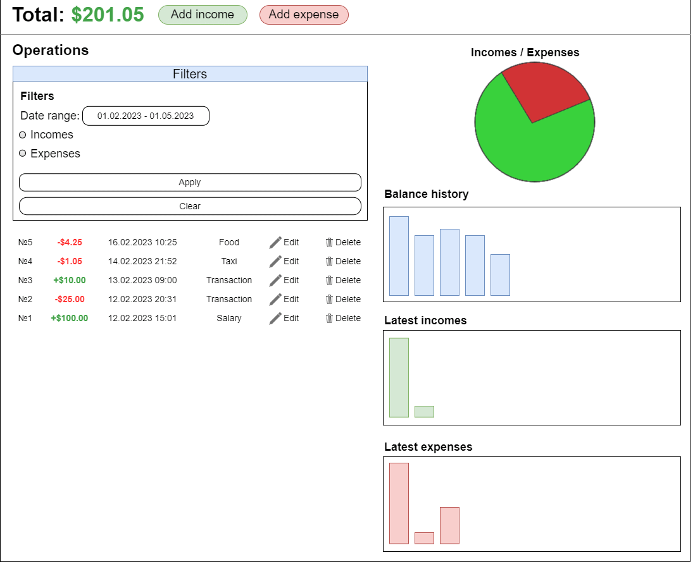

# Statok (Money manager)
## Vision
«Statok» is a money management web-application that allows user to track his incomes and expenses. User can manually add his incomes and expenses, dividing them into default and custom categories.

**Application should provide:**
* Storing information about user's income and expense financial operations (the "operations") in a database;
* Display list of the operations;
* Filtering list of the operations (by type, category, date);
* Display charts based on the operations information;
* Updating list of the operations (adding, editing, deleting);
* Display list of categories;
* Display operations of the specific category;
* Updating list of the categories (adding, editing, deleting);
* Display the number of operations of each category;
* Display sum of the incomes and expenses of each category;
* Display available budget based on the operations data;

## 1. Operations
### 1.1 Display list of operations
This mode displays a list of all operations added by user. available budged calculated based on all operations values is displayed at the top of a list. Opertaions charts are displayed to the right of a list.
Also, here user can manipulate with a list of the operations (add, edit, delete).

**Main scenario:**
* User selects item "Operations" or logo of the web application
* Application displays list of Operations

Pic 1.1.1 View total budget, operations list and operation charts

A list of the operations contains following columns:
* ID of the operation;
* Value of the opertaion (incomes are shown in green color, expenses are shown in red color);
* Date of the operation;
* Category of the operation;
* Edit button;
* Delete button;

Function for calculating total budget: Total budget = sum(values of all operations)

This mode also provides the possibility of filtering by operation type and date:

Pic 1.1.2 View after expanding filter section

**Filtering:**
* In the filter section, the user sets a date range and/or operation type and presses the apply button;
* A list of operations refreshes based on the filters provided by user;
* By clicking the clear button, list of operations reverts to its original state;

### 1.2 Add income and expense
**Main scenario:**
* User clicks the "Add income" or "Add expense" button in a operations list view mode;
* Application displays popup form to enter operation value and to choose operation category;
* User enters fills form and presses "Add" button;
* If operation value or category is incorrect, error message is shown;
* If operation value and category is valid, the record is adding to database;
* If new operation is successfully added to database, a list of operations is displayed;

**Cancel scenario:**
* User clicks the "Add income" or "Add expense" button in a operations list view mode;
* Application displays popup form to enter operation value and to choose operation category;
* User enters operation data and presses "Cancel" button;
* Data don't save in database;
* Popup form closes;

Pic 1.2.1 Add income popup form

Pic 1.2.2 Add expense popup form

**Constrains for operation data:**
* Operation value - max value is $999,999,999.9999

### 1.3 Edit operation
**Main scenario:**
* User clicks the "Edit" button in a operations list view mode;
* Application displays a operation details form with fields of the operation data (value, date and category);
* User updates fields with the operation data and presses "Save" button;
* If any data is incorrect, error message is shown;
* If data is valid, the record is adding to database;
* If data updates is successfully added to database, a list of operations is displayed;

**Cancel scenario:**
* User clicks the "Edit" button in a operations list view mode;
* Application displays a form with fields of the operation data (value, date and category);
* User updates fields with the operation data and presses any button, except for the "Save" button;
* Data don't save in database;

Pic 1.3 Operation details form

**When editing a operation, the following details are entered:**
* Value - numeric value of the operation;
* Date - date and time when operation took place;
* Category - corresponding category of the operation;

**Constrains for operation data:**
* Operation value - max value is $999,999,999.9999;
* Operation date - date in format dd/mm/yyyy;

### 1.4 Remove the operation
**Scenario №1**
* User clicks the "Delete" button in a operations list view mode;
* Application displays a confirmation message box;
* User confirms the removal of the operation;
* Record is deleted from database;
* If error occurs, error message is displayed;
* If record is successfully deleted, then a list of operations without deleted record sis displayed;

**Cancel scenario №1**
* User clicks the "Delete" button in a operation details view mode;
* Application displays a confirmation message box;
* User presses "Cancel" button;
* List of operations is displayed without changes;

**Scenario №2**
* User clicks the "Delete" button in a operation details view mode;
* Application displays a confirmation message box;
* User confirms the removal of the operation;
* Record is deleted from database;
* If error occurs, error message is displayed;
* If record is successfully deleted, then a list of operations without deleted record sis displayed;

Pic 1.4 Delete operation confirmation message box

## 2. Categories
### 2.1 Display list of categories
This view is focused on working with operations categories. It displays list of all categories, divided by two groups: income categories and expense categories.
Each category is shown along with statistics: number of the operations and total amount of the operations.

**Main scenario:**
* User selects item "Categories";
* Application displays list of Categories;

Pic 2.1 View the categories list

A list is displayed as square items. Each item has:
* Name of the category;
* Number of the operations;
* Total amount of the operations;

Function for calculating total amount: Total amount = sum(values of all operations in a category)

### 2.2 Display category details
The main purpose of this view is to display detailed information about sertain category. In this view user can see the operations in category, chart based on this operations, edit or delete category, clear all operations within category.

**Main scenario:**
* User selects certain category in a list of categories;
* Application displays details of selected category;

Pic 2.2 View the category details

### 2.3 Add category
**Main scenario:**
* User clicks "Add income category" or "Add expense category" buttons in the categories list view mode;
* Application displays popup form to enter the name of a category;
* User enters name of a category and presses "Add" button;
* If data is incorrect, error message is shown;
* If data is valid, the record is adding to database;
* If new category is successfully added to database, a updated list of categories is displayed;

**Cancel scenario:**
* User clicks the "Add income category" or "Add expense category" buttons in the categories list view mode;
* Application displays popup form to enter the name of a category;
* User enters name of a category and presses "Cancel" button;
* Data don't save in database;
* Popup form closes;

Pic 2.3.1 Add income category popup form

Pic 2.3.2 Add expense category popup form

**When creating a category, the following details are entered:**
* Name - new name of the category;

**Constrains for category data:**
* Category name - maximum length is 50 characters;

### 2.4 Edit category
**Main scenario:**
* User clicks the "Edit" button in a category details view mode;
* Application displays a popup form with category name;
* User updates name field and presses "Save" button;
* If data is incorrect, error message is shown;
* If data is valid, the record is updating in the database;
* If data update is successfully added to database, a updated category details is displayed;

**Cancel scenario:**
* User clicks the "Edit" button in a category details view mode;
* Application displays a popup form with category name;
* User updates name field and presses "Cancel" button;
* Data don't save in database;
* Popup form closes;

Pic 2.4 Category edit popup form

**When editing a category, the following details are entered:**
* Name - new name of the category;

**Constrains for category data:**
* Category name - maximum length is 50 characters;

**Editing category restrictions:**
* User cannot edit category "Other" - it is default;

### 2.5 Delete all operations in a category
**Main scenario:**
* User clicks "Delete all operations" button in a category details view mode;
* Application displays a confirmation popup;
* User confirms deleting;
* All records in a category is deleted from database;
* If error occurs, error message is displayed;
* If records is successfully deleted, then a category details without any operation is displayed;

**Cancel scenario:**
* User clicks the "Delete all operations" button in a category details view mode;
* Application displays a confirmation popup;
* User presses "Cancel" button;
* Records are not deleting;
* Confirmation popup closes;

Pic 2.5 Delete all operations confirmation popup

### 2.6 Delete category
**Main scenario:**
* User clicks "Delete" button in a category details view mode;
* Application displays a confirmation popup;
* User confirms category deleting;
* The category is deleted from database;
* If error occurs, error message is displayed;
* If category is successfully deleted, all operations in that category moved into default category "Other";
* If category is successfully deleted, then a list of all categories without deleted category is displayed;

**Cancel scenario:**
* User clicks "Delete" button in a category details view mode;
* Application displays a confirmation popup;
* User presses "Cancel" button;
* Category are not deleting from database;
* Confirmation popup closes;

Pic 2.6 Delete category confirmation popup

**Deleting category restrictions:**
* User cannot delete category "Other" - it is default;